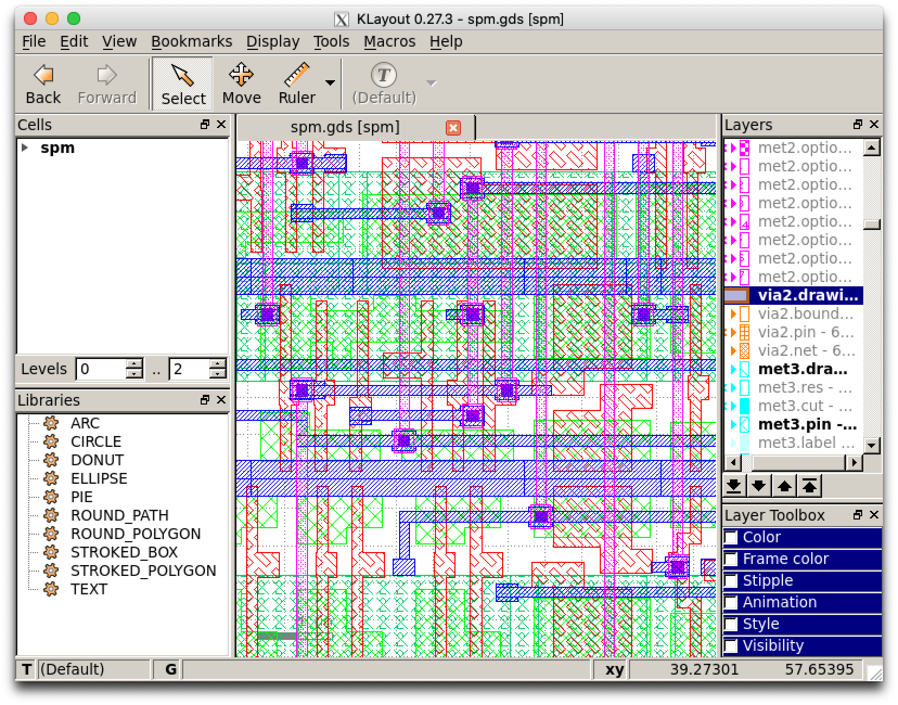

# OpenLane_GUI
This repository is to use GUI such as KLayout and magic of OpenLane.

## How to use for Intel Mac and Windows
Following commands execute docker-compose and docker to build gui/Dockerfile.
This gui environment invokes ssh-server in docker container.
Users can login ssh command and display GUI via X11 forwarding.
- docker-compose build
- docker-compose up
- ./run_ssh
See also:
https://take6shin-tech-diary.com/openlane-skywater/

## How to use for M1 Mac
Following commands build Docker image on Lima MV.
This gui environment invokes ssh-server in docker container.
Users can login ssh command and display GUI via X11 forwarding.
- limactl start default.yaml
- ./run_build.M1
- ./run_server.M1
- ./run_ssh.M1
See also:
https://take6shin-tech-diary.com/m1-macopenlane-skywater/

## RTL sample for newly created design
Following design is very simple clocked inverter logic.
- design/new_design/src/new_design.v
- design/new_design/src/new_design.sdc
